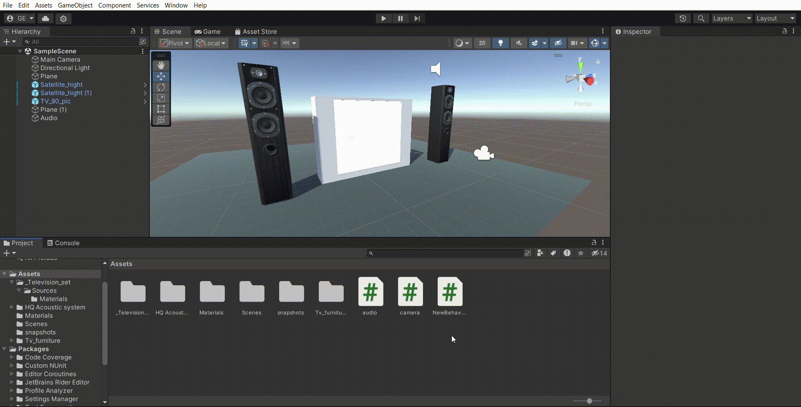

# II-pr_micro_camara

A continuación se muestra un gif con el funcionamiento de cada uno de los ejercicios:

## Ejercicio 1

Si quiere escuchar el audio del gif, puede hacerlo [aquí](video/ejercicio1.mp4)

Script usado para el ejercicio 1: [script1](scripts/touch_spider.cs)

## Ejercicio 2

Si quiere escuchar el audio del gif, puede hacerlo [aquí](video/ejercicio2.mp4)

Script usado para el ejercicio 2: [script2](scripts/audio.cs)

## Ejercicio 3, 4 y 5

Script usado para el funcionamiento de los ejercicios 3, 4 y 5: [script3-4-5](scripts/camera.cs)
